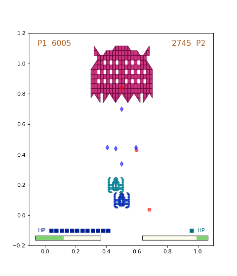
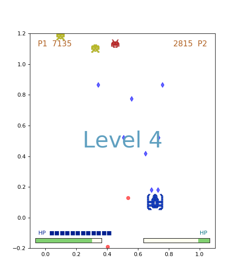

# Final Tournament Game of Phys4009-Numerical-Analysis 2020
1.  This is the class tournament in Phys4009
    -   Rule-based agents play the starwar-liked game
    -   Students play against each other with agents designed themselves.
    -   Agent with higher score win the game

2.  The source code won the 1st place in the first round of Phys4009-2020

3.  Some gaming pictures
     
    
## Run
1.  python3 tournament.py
2.  press "q" to quit